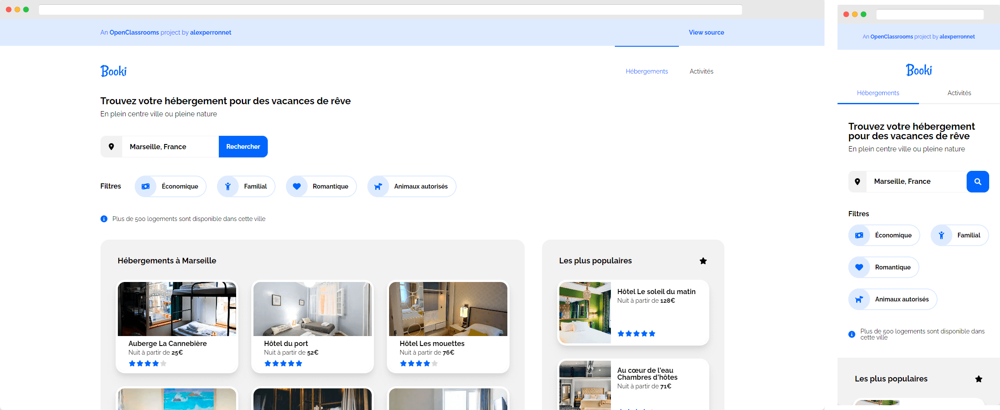

# Booki



## Overview

### The Project

The project is to create a prototype of the Booki website by integrating the HTML and CSS model.

### User Story

- [x] the integration must be done only in HTML5 and CSS3, no frameworks must be used.
- [x] The HTML must be validate by W3C.
- [x] The CSS must be validate by W3C.
- [x] The search field must be an input field. The search functionality does not have to be implemented.
- [x] Each cards must be fully clickable.
- [x] Filters should change appearance on hover.
- [x] In the menu, all links are anchors that should lead to the sections of the page.
- [x] The website must be responsive.
- [x] The integration must be done in desktop first.
- [x] The images must be the right size for a better visual rendering and good performance.
- [x] It is important to use pixels and percentage instead of EM and REM.
- [x] It is recommended to use Flexbox but it is allowed to use Grid.
- [x] The prototype must be compatible with the latest versions of Google Chrome and Mozilla Firefox.

### Style Guide

#### Colors

The Colors are: `#0065FC`, `#DEEBFF`, `#F2F2F2`

#### Font

The font is [Raleway](https://fonts.google.com/specimen/Raleway).

#### Icons

Icons are from [Font Awesome](https://fontawesome.com/).

## Local Development

Just clone this repo and use the live server to test the project.

```sh
git glone https://github.com/alexperronnet/openclassrooms-p2-booki.git
```

```sh
cd openclassrooms-p2-booki
```

---

See the [live URL](https://alexperronnet.github.io/openclassrooms-p2-booki/)
